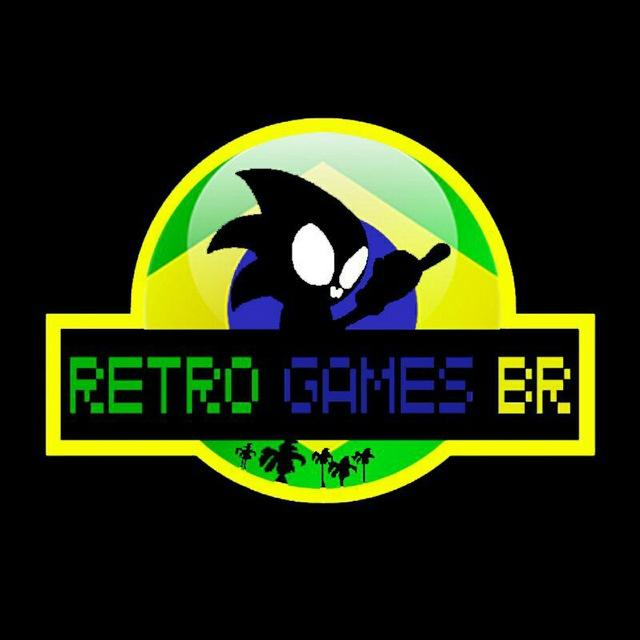
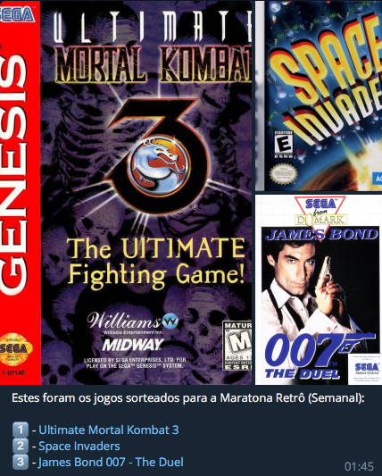

  

# RetroGames 🇧🇷 - Bot

Bot from [RetroGames 🇧🇷](http://t.me/retrogamesbr)

> - Sorteio de jogos retrô aos sábados;
> - Canal [VirtualRoms](https://t.me/s/virtualroms/3523) exclusivo no Telegram.
> - Premiações e brindes para os membros mais participativos
> - Top 10 Games, Consoles e Gêneros mais sorteados

### :gear: Como funciona ?

- Sorteio de jogos retrô todo sábado às 00:05hs
  

### :rocket: Tecnologias

<table>
  <thead>
    <th>Backend</th>
    <th>Firebase</th>
  </thead>
  <tbody>
    <tr>
      <td>Node.js</td>
      <td>Cloud Functions</td>
    </tr>
    <tr>
      <td>Express</td>
      <td>Firestore</td>
    </tr>
    <tr>
      <td>Node-cache</td>
      <td>Hosting</td>
    </tr>
    <tr>
      <td>Typescript</td>
      <td>Google Analytics</td>
    </tr>
  </tbody>
</table>

## :recycle: Como contribuir

- Faça um Fork desse repositório,
- Crie uma branch com a sua feature: `git checkout -b my-feature`
- Commit suas mudanças: `git commit -m 'feat: My new feature'`
- Push a sua branch: `git push origin my-feature`

## :memo: License

Esse projeto está sob a licença MIT. Veja o arquivo [LICENSE](LICENSE.md) para mais detalhes.